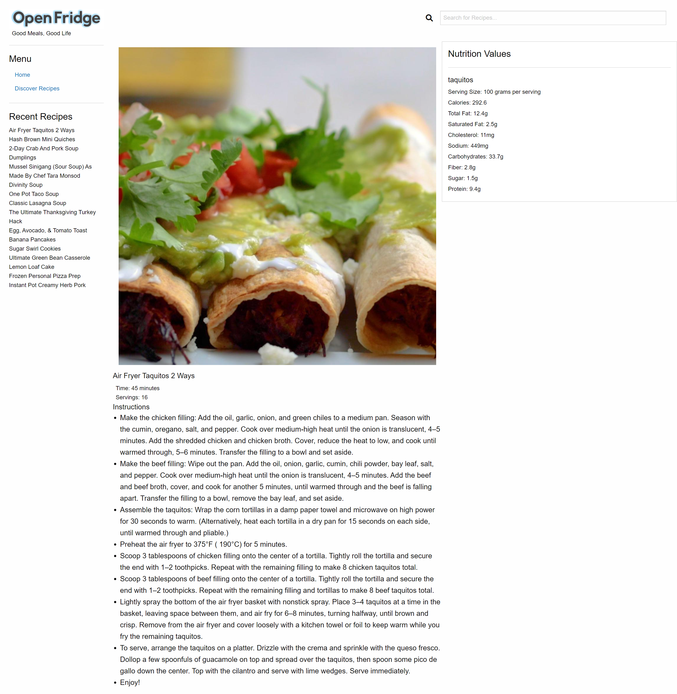

# OPEN FRIDGE

## CONTENTS OF THIS FILE

* Introduction
* How to Use
* Deployment
* Contribution

## INTRODUCTION

[Open Fridge](https://paperpatch.github.io/open_fridge/)
 
 
A fully reponsive recipe dashboard website where the user can find recipes and nutritional values based on Tasty API and Ninjas Nutritional API. A simple, useful daily app that anyone can use to cook a meal from home where working from home is getting normalized.
 
 
Built With:

- HTML
- CSS
- JavaScript
- Foundation CSS Framework 6.7.3
- jQuery
- Tasty API
- Ninjas Nutritional API
- Font Awesome 6.0

 
 
 

## HOW TO USE

In this repository, you can find a [live](https://paperpatch.github.io/open_fridge/) url deployment of a fully functioning recipe and nutritional value lookup. Upon visitng the web address, you may search for a recipe dish that you would like to make. It will display a set of recipes for you to choose from. Clicking on an image will display a set of instructions and nutritional values from the recipe.
 
 
When a specific recipe dish is selected, the name of the dish will be appended on the `[Recent Recipes]` list on the left navigation bar. Data is stored and transferred via localStorage.

## DEPLOYMENT

[Click the link here](https://paperpatch.github.io/open_fridge/)

## CONTRIBUTION

- Patrick Chen - paperpatch
- Brandon Conte - BrandonConte
- Michael Zelaya - Vertis-Z